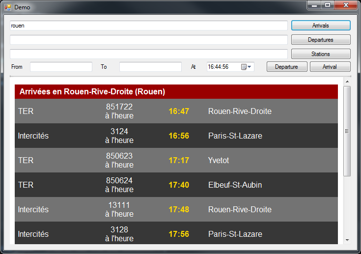
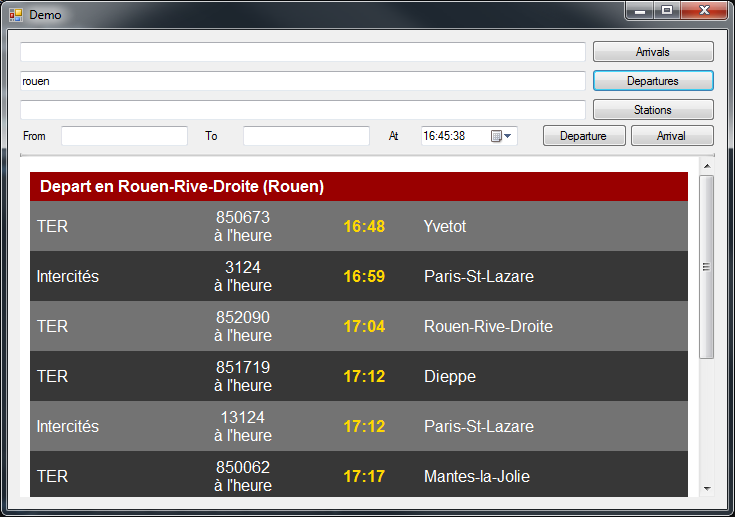
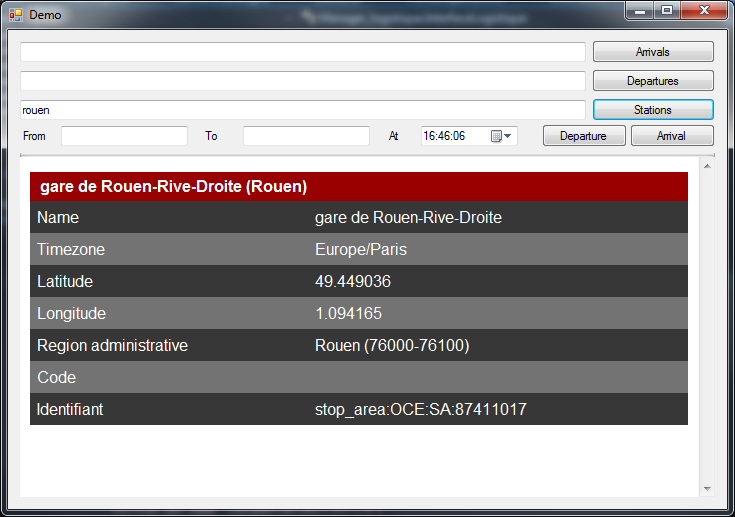
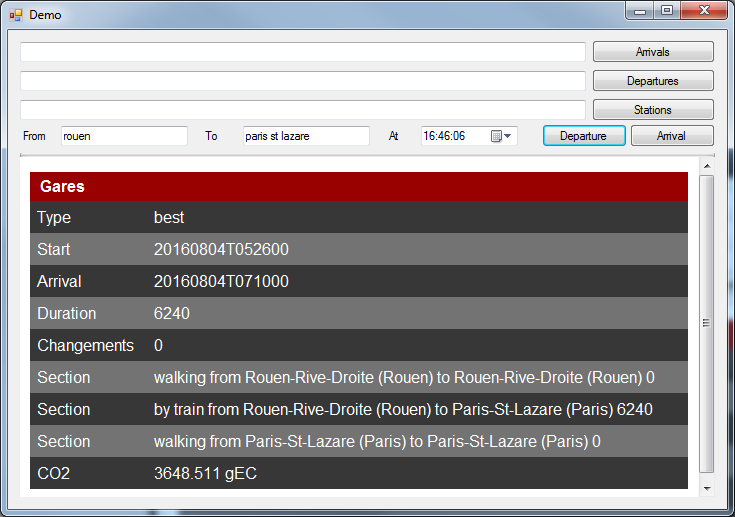

# Manager Logistique : exchange to have transport details [](http://servodroid.com)

[](https://www.nuget.org/packages/Droid_Logistique/)    [](https://raw.githubusercontent.com/ThibaultMontaufray/Tools4Libraries/master/License) [](https://travis-ci.org/ThibaultMontaufray/Manager-Logistique) [](https://coveralls.io/github/ThibaultMontaufray/Manager-Logistique?branch=master)  [](http://servodroid.com:8080/job/CI-Manager-Logistique/)  [](https://codeclimate.com/github/ThibaultMontaufray/Manager-Logistique)

# Usage :

Set the token in Controler/Queries.cs or set it in the config file
```csharp
public const string TOKEN = "azertyuiopmlkjhgfdsqwxcvbn.125.458.679.254";
```
and run the demo
```csharp
Application.Run(new Demo());
```

# Demo

Arrivals from a station
<p></p>

Departure from a station
<p></p>

Station details
<p></p>

Looking for a journey
<p></p>
